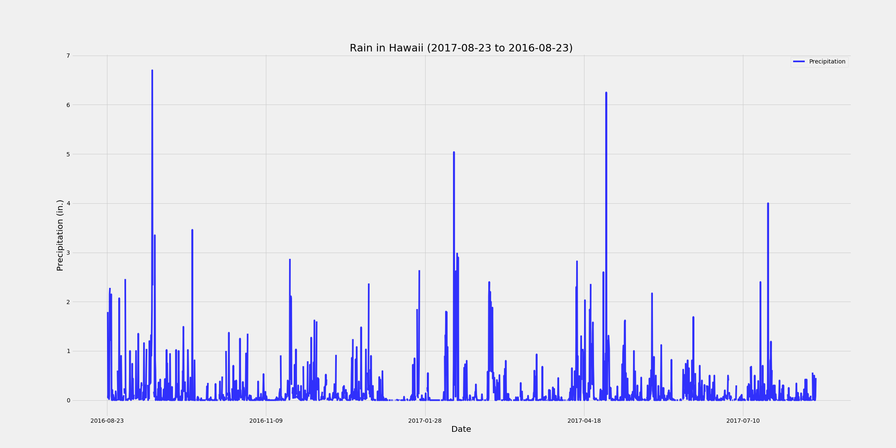
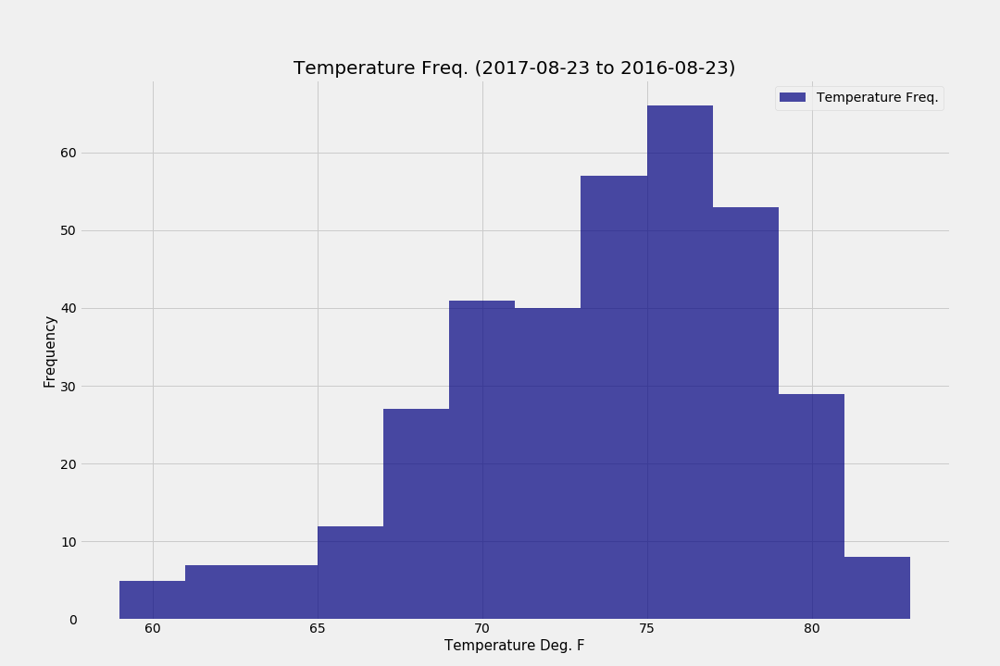

# 10.sqlalchemy-challenge
In this assignment, we are asked to utilize SQLAlchemy to query information to analyze. The data analyzed explores rain fall information from different locations in Hawaii.
The following results are as follows:

Precipitation Analysis:

Station Analysis:
